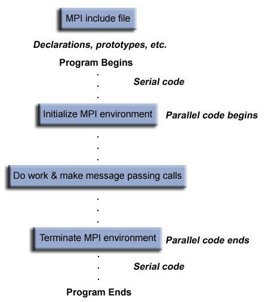

ref:[Message Passing Interface (MPI)](https://computing.llnl.gov/tutorials/mpi/)

## 摘要
消息传递接口标准（MPI）是基于MPI论坛共识的消息传递库标准，MPI论坛有40多个参与组织，其中包括供应商，研究人员，软件库开发人员和用户。消息传递接口的目标是为消息传递建立一种可移植，高效且灵活的标准，该标准将广泛用于编写消息传递程序。因此，MPI是第一个标准化的，独立于供应商的消息传递库。使用MPI开发消息传递软件的优势与可移植性，效率和灵活性的设计目标紧密匹配。 MPI不是IEEE或ISO标准，但实际上已成为在HPC平台上编写消息传递程序的“行业标准”。

本教程的目的是教那些不熟悉MPI的人如何根据MPI标准开发和运行并行程序。提出的主要主题集中于对新MPI程序员最有用的主题。本教程首先介绍MPI入门，背景和基本信息。接下来是对MPI例程的详细介绍，这些例程对新MPI程序员最有用，包括MPI环境管理，点对点通信和集体通信例程。提供了C和Fortran中的大量示例以及实验室练习。

教程材料还包括更高级的主题，例如“派生数据类型”，“组和Communicator管理例程”以及“虚拟拓扑”。但是，这些实际上并没有在讲座中介绍，而是为那些有兴趣的人提供“进一步的阅读”。

## 什么是MPI

### 一种接口规范

- M P I = Message Passing Interface
- MPI是针对消息传递库的开发人员和用户的规范。 就其本身而言，它不是一个库-而是有关该库应该是什么的规范。
- 简而言之，消息传递接口的目的是为编写消息传递程序提供广泛使用的标准。 该接口尝试是：
  - Practical 
  - Portable 
  - Efficient 
  - Flexible 
- MPI标准已进行了许多修订，最新版本为MPI-3.x。
- 已经为C和Fortran90语言绑定定义了接口规范：
- 实际的MPI库实现在支持的MPI标准的版本和功能方面有所不同。 开发人员/用户将需要意识到这一点。
  
### 编程模型
- MPI最初是为分布式内存体系结构设计的，该体系结构在当时（1980年代-1990年代初期）变得越来越流行。
- 随着架构趋势的变化，共享内存SMP通过网络进行组合，从而创建了混合分布式内存/共享内存系统。
- MPI实现者调整了其库，以无缝处理两种类型的基础内存体系结构。 他们还采用/开发了处理不同互连和协议的方式。
- 如今，MPI几乎可以在任何硬件平台上运行：
  - Distributed Memory 
  - Shared Memory 
  - Hybrid
- 但是，无论机器的基础物理体系结构如何，编程模型显然仍然是分布式内存模型。
- 所有并行性都是明确的：程序员负责正确识别并行性并使用MPI构造实现并行算法。

### 文档
- 有关MPI标准所有版本的文档，请访问：[http：//www.mpi-forum.org/docs/](http：//www.mpi-forum.org/docs/)。
  
##  LLNL MPI Implementations and Compilers

## 开始学习

### 一般的MPI编程结构

~~~bash
#include "mpi.h"
#include <stdio.h>
#include <stdlib.h>

int main (int argc, char *argv[])
{
int numtasks, rank, dest, source, rc, count, tag=1;
char inmsg, outmsg='x';
MPI_Status Stat;

MPI_Init(&argc,&argv);
MPI_Comm_size(MPI_COMM_WORLD, &numtasks);
MPI_Comm_rank(MPI_COMM_WORLD, &rank);

if (rank == 0) {
  dest = 1;
  source = 1;
  rc = MPI_Send(&outmsg, 1, MPI_CHAR, dest, tag, MPI_COMM_WORLD);
  rc = MPI_Recv(&inmsg, 1, MPI_CHAR, source, tag, MPI_COMM_WORLD, &Stat);
  }

else if (rank == 1) {
  dest = 0;
  source = 0;
  rc = MPI_Recv(&inmsg, 1, MPI_CHAR, source, tag, MPI_COMM_WORLD, &Stat);
  rc = MPI_Send(&outmsg, 1, MPI_CHAR, dest, tag, MPI_COMM_WORLD);
  }

MPI_Finalize();
}
~~~

### 头文件
- 所有进行MPI库调用的程序都必需。
<table border="1">
    <tr>
        <th>C include file </th>
        <th>Fortran include file</th>
    </tr>
    <tr>
        <td>#include "mpi.h" </td>
        <td>	include 'mpif.h' </td>
    </tr>
</table>

- MPI调用格式
<table>
    <tr>
        <th colspan=2>C Binding</th>
    </tr>
    <tr>
        <th>Format:</th>
        <td>rc = MPI_Xxxxx(parameter, ... )</td>
    </tr>
    <tr>
        <th>Example:</th>
        <td>rc = MPI_Bsend(&buf,count,type,dest,tag,comm) </td>
    <tr>
        <th>Error code:</th>
        <td>Returned as "rc". MPI_SUCCESS if successful </td>
    </tr>
</table>

### Communicators and Groups:
- MPI使用称为通信器和组的对象来定义哪些进程集合可以相互通信。
- 大多数MPI例程都要求您指定一个通讯器作为参数。
- 大多数MPI例程都要求您指定一个通讯器作为参数。
- 通讯器和组将在后面详细介绍。 现在，只要需要通信器，就只需使用MPI_COMM_WORLD-它是预定义的通信器，它包含所有MPI进程。
  

### Rank:

- 在通信器中，每个进程都有自己的唯一整数标识符，该标识符在进程初始化时由系统分配。 rank有时也称为“任务ID”。 rank是连续的，从零开始。
- 程序员用来指定消息的源和目标。 通常由应用程序有条件地用来控制程序的执行（如果rank = 0则执行此操作，如果rank = 1则执行此操作）。

### Error Handling: 
- 如上面“ MPI调用的格式”部分中所述，大多数MPI例程都包含返回/错误代码参数。
- 但是，根据MPI标准，如果发生错误，MPI调用的默认行为是中止。 这意味着您可能将无法捕获MPI_SUCCESS（零）以外的返回/错误代码。
- 该标准确实提供了覆盖此默认错误处理程序的方法。 此处提供有关如何执行此操作的讨论。 您也可以参考[http://www.mpi-forum.org/docs/](http://www.mpi-forum.org/docs/)上相关MPI标准文档的错误处理部分。
- 向用户显示的错误类型取决于实现。

## 环境管理程序
这套例程用于询问和设置MPI执行环境，并涵盖了多种目的，例如初始化和终止MPI环境，查询rank的identity，查询MPI库的版本等。大多数常用的例程如下所述。

### [MPI_Init](https://computing.llnl.gov/tutorials/mpi/man/MPI_Init.txt)

初始化MPI执行环境。 必须在每个MPI程序中调用此函数，必须在任何其他MPI函数之前调用此函数，并且在MPI程序中只能调用一次。 对于C程序，MPI_Init可以用于将命令行参数传递给所有进程，尽管这不是标准要求的，并且取决于实现。
~~~c
MPI_Init (&argc,&argv)
MPI_INIT (ierr) 
~~~

### [MPI_Comm_size](https://computing.llnl.gov/tutorials/mpi/man/MPI_Comm_size.txt)
返回指定通信器中MPI进程的总数，例如MPI_COMM_WORLD。 如果通信器是MPI_COMM_WORLD，则它表示应用程序可用的MPI任务数。

~~~c
MPI_Comm_size (comm,&size)
MPI_COMM_SIZE (comm,size,ierr) 
~~~

### [MPI_Comm_rank](https://computing.llnl.gov/tutorials/mpi/man/MPI_Comm_rank.txt)

返回指定通信器中调用MPI进程的rank。 最初，在通信器MPI_COMM_WORLD中，将为每个进程分配一个介于0和任务数-1之间的唯一整数rank。 该rank通常称为任务ID。 如果一个进程与其他通讯器相关联，那么在每个通讯器中也将具有唯一的rank。

~~~c
MPI_Comm_rank (comm,&rank)
MPI_COMM_RANK (comm,rank,ierr)
~~~

### [MPI_Abort](https://computing.llnl.gov/tutorials/mpi/man/MPI_Abort.txt)

终止与通信器关联的所有MPI进程。 在大多数MPI实现中，无论指定哪个通信器，它都会终止所有进程。

~~~c
MPI_Abort (comm,errorcode)
MPI_ABORT (comm,errorcode,ierr) 
~~~

### [MPI_Get_processor_name](https://computing.llnl.gov/tutorials/mpi/man/MPI_Get_processor_name.txt)

返回进程名称。 还返回名称的长度。 “名称”的缓冲区的大小必须至少为MPI_MAX_PROCESSOR_NAME个字符。 返回到“名称”中的是与实现相关的-可能与“主机名”或“主机” shell命令的输出不同。

~~~c
MPI_Get_processor_name (&name,&resultlength)
MPI_GET_PROCESSOR_NAME (name,resultlength,ierr)
~~~

### [MPI_Get_version](https://computing.llnl.gov/tutorials/mpi/man/MPI_Get_version.txt)

返回由库实现的MPI标准的版本和Subversion。

~~~c
MPI_Get_version (&version,&subversion)
MPI_GET_VERSION (version,subversion,ierr) 
~~~

### [MPI_Initialized](https://computing.llnl.gov/tutorials/mpi/man/MPI_Initialized.txt)

指示是否已调用MPI_Init-将标志返回为逻辑true（1）或false（0）。 MPI要求每个进程仅一次调用MPI_Init。 对于想要使用MPI并准备在必要时调用MPI_Init的模块，这可能会带来问题。 MPI_Initialized解决了此问题。

~~~c
MPI_Initialized (&flag)
MPI_INITIALIZED (flag,ierr) 
~~~

### [MPI_Wtime](https://computing.llnl.gov/tutorials/mpi/man/MPI_Wtime.txt)

返回调用处理器上经过的挂钟时间，以秒为单位（双精度）。

~~~c
MPI_Wtime ()
MPI_WTIME () 
~~~

### [MPI_Wtick](https://computing.llnl.gov/tutorials/mpi/man/MPI_Wtick.txt)

返回MPI_Wtime的分辨率（以秒为单位）（双精度）。
~~~c
MPI_Wtick ()
MPI_WTICK () 
~~~

### [MPI_Finalize](https://computing.llnl.gov/tutorials/mpi/man/MPI_Finalize.txt)
终止MPI执行环境。 此函数应该是每个MPI程序中最后一个调用的MPI例程-此后不得再调用其他MPI例程。

~~~c
MPI_Finalize ()
MPI_FINALIZE (ierr) 
~~~

## Examples: Environment Management Routines
~~~c
// required MPI include file  
#include "mpi.h"
#include <stdio.h>
int main(int argc, char *argv[]) {
   int  numtasks, rank, len, rc; 
   char hostname[MPI_MAX_PROCESSOR_NAME];

   // initialize MPI  
   MPI_Init(&argc,&argv);

   // get number of tasks 
   MPI_Comm_size(MPI_COMM_WORLD,&numtasks);

   // get my rank  
   MPI_Comm_rank(MPI_COMM_WORLD,&rank);

   // this one is obvious  
   MPI_Get_processor_name(hostname, &len);
   printf ("Number of tasks= %d My rank= %d Running on %s\n", numtasks,rank,hostname);

        // do some work with message passing 

   // done with MPI  
   MPI_Finalize();
}
~~~

## MPI Exercise 1

**[ GO TO THE EXERCISE HERE ](https://computing.llnl.gov/tutorials/mpi/exercise.html)**

## 点对点通讯程序

### MPI消息传递例程参数

MPI点对点通信例程通常具有采用以下格式之一的参数列表：

<table width="90%" cellspacing="0" cellpadding="5" border="1">
<tbody><tr><td bgcolor="#FOF5FE"><b>Blocking sends
    </b></td><td><tt><b><nobr>
    MPI_Send(buffer,count,type,dest,tag,comm) 
</nobr></b></tt></td></tr><tr><td bgcolor="#FOF5FE"><b>Non-blocking sends
    </b></td><td><tt><b><nobr>
    MPI_Isend(buffer,count,type,dest,tag,comm,request) 
</nobr></b></tt></td></tr><tr><td bgcolor="#FOF5FE"><b>Blocking receive
    </b></td><td><tt><b><nobr>
    MPI_Recv(buffer,count,type,source,tag,comm,status) 
</nobr></b></tt></td></tr><tr><td bgcolor="#FOF5FE"><b>Non-blocking receive
    </b></td><td><tt><b><nobr>
    MPI_Irecv(buffer,count,type,source,tag,comm,request) </nobr></b></tt></td>
</tr></tbody></table>

### Buffer

引用要发送或接收的数据的程序（应用程序）地址空间。 在大多数情况下，这只是发送/接收的变量名。 对于C程序，此参数通过引用传递，并且通常必须在前面加上一个＆符：＆var1

### Data Count
指示要发送的特定类型的数据元素的数量。

### Data Type
出于可移植性的考虑，MPI预定义了其基本数据类型。 下表列出了标准要求的那些内容。

<table width="90%" cellspacing="0" cellpadding="5" border="1">
<tbody><tr><th colspan="2">C Data Types</th>
    <th colspan="2">Fortran Data Types</th>
</tr><tr><td bgcolor="#FOF5FE"><tt><b>MPI_CHAR</b></tt></td>
    <td>char</td>
    <td bgcolor="#FOF5FE"><tt><b>MPI_CHARACTER</b></tt></td>
    <td>character(1)</td>
</tr><tr><td bgcolor="#FOF5FE"><tt><b>MPI_WCHAR</b></tt></td>
    <td>wchar_t - wide character</td>
    <td bgcolor="#FOF5FE">&nbsp;</td>
    <td>&nbsp;</td>
</tr><tr><td bgcolor="#FOF5FE"><tt><b>MPI_SHORT</b></tt></td>
    <td>signed short int</td>
    <td bgcolor="#FOF5FE">&nbsp;</td>
    <td>&nbsp;</td>
</tr><tr><td bgcolor="#FOF5FE"><tt><b>MPI_INT</b></tt></td>
    <td>signed int</td>
    <td bgcolor="#FOF5FE"><tt><b>MPI_INTEGER MPI_INTEGER1
     MPI_INTEGER2 MPI_INTEGER4</b></tt></td>
    <td>integer integer*1 integer*2 integer*4</td>
</tr><tr><td bgcolor="#FOF5FE"><tt><b>MPI_LONG</b></tt></td>
    <td>signed long int</td>
    <td bgcolor="#FOF5FE">&nbsp;</td>
    <td>&nbsp;</td>
</tr><tr><td bgcolor="#FOF5FE"><tt><b>MPI_LONG_LONG_INT
     MPI_LONG_LONG</b></tt></td>
    <td>signed long long int</td>
    <td bgcolor="#FOF5FE">&nbsp;</td>
    <td>&nbsp;</td>
</tr><tr><td bgcolor="#FOF5FE"><tt><b>MPI_SIGNED_CHAR</b></tt></td>
    <td>signed char</td>
    <td bgcolor="#FOF5FE">&nbsp;</td>
    <td>&nbsp;</td>
</tr><tr><td bgcolor="#FOF5FE"><tt><b>MPI_UNSIGNED_CHAR</b></tt></td>
    <td>unsigned char</td>
    <td bgcolor="#FOF5FE">&nbsp;</td>
    <td>&nbsp;</td>
</tr><tr><td bgcolor="#FOF5FE"><tt><b>MPI_UNSIGNED_SHORT</b></tt></td>
    <td>unsigned short int</td>
    <td bgcolor="#FOF5FE">&nbsp;</td>
    <td>&nbsp;</td>
</tr><tr><td bgcolor="#FOF5FE"><tt><b>MPI_UNSIGNED</b></tt></td>
    <td>unsigned int</td>
    <td bgcolor="#FOF5FE">&nbsp;</td>
    <td>&nbsp;</td>
</tr><tr><td bgcolor="#FOF5FE"><tt><b>MPI_UNSIGNED_LONG</b></tt></td>
    <td>unsigned long int</td>
    <td bgcolor="#FOF5FE">&nbsp;</td>
    <td>&nbsp;</td>
</tr><tr><td bgcolor="#FOF5FE"><tt><b>MPI_UNSIGNED_LONG_LONG</b></tt></td>
    <td>unsigned long long int</td>
    <td bgcolor="#FOF5FE">&nbsp;</td>
    <td>&nbsp;</td>
</tr><tr><td bgcolor="#FOF5FE"><tt><b>MPI_FLOAT</b></tt></td>
    <td>float</td>
    <td bgcolor="#FOF5FE"><tt><b>MPI_REAL MPI_REAL2
     MPI_REAL4 MPI_REAL8
    </b></tt></td><td>real real*2 real*4 real*8</td>
</tr><tr><td bgcolor="#FOF5FE"><tt><b>MPI_DOUBLE</b></tt></td>
    <td>double</td>
    <td bgcolor="#FOF5FE"><tt><b>MPI_DOUBLE_PRECISION</b></tt></td>
    <td>double precision</td>
</tr><tr><td bgcolor="#FOF5FE"><tt><b>MPI_LONG_DOUBLE</b></tt></td>
    <td>long double</td>
    <td bgcolor="#FOF5FE">&nbsp;</td>
    <td>&nbsp;</td>
</tr><tr><td bgcolor="#FOF5FE"><tt><b>MPI_C_COMPLEX MPI_C_FLOAT_COMPLEX</b></tt></td>
    <td>float _Complex</td>
    <td bgcolor="#FOF5FE"><tt><b>MPI_COMPLEX</b></tt></td>
    <td>complex</td>
</tr><tr><td bgcolor="#FOF5FE"><tt><b>MPI_C_DOUBLE_COMPLEX</b></tt></td>
    <td>double _Complex</td>
    <td bgcolor="#FOF5FE"><tt><b>MPI_DOUBLE_COMPLEX</b></tt></td>
    <td>double complex</td>
</tr><tr><td bgcolor="#FOF5FE"><tt><b>MPI_C_LONG_DOUBLE_COMPLEX</b></tt></td>
    <td>long double _Complex</td>
    <td bgcolor="#FOF5FE">&nbsp;</td>
    <td>&nbsp;</td>
</tr><tr><td bgcolor="#FOF5FE"><tt><b>MPI_C_BOOL</b></tt></td>
    <td>_Bool</td>
    <td bgcolor="#FOF5FE"><tt><b>MPI_LOGICAL</b></tt></td>
    <td>logical</td>

</tr><tr><td bgcolor="#FOF5FE"><tt><b>MPI_INT8_T 
 MPI_INT16_T MPI_INT32_T  MPI_INT64_T</b></tt></td>
    <td>int8_t int16_t int32_t  int64_t</td>
    <td bgcolor="#FOF5FE">&nbsp;</td>
    <td>&nbsp;</td>
</tr><tr><td bgcolor="#FOF5FE"><tt><b>MPI_UINT8_T 
 MPI_UINT16_T  MPI_UINT32_T  MPI_UINT64_T </b></tt></td>
    <td>uint8_t uint16_t uint32_t uint64_t</td>
    <td bgcolor="#FOF5FE">&nbsp;</td>
    <td>&nbsp;</td>
</tr><tr><td bgcolor="#FOF5FE"><tt><b>MPI_BYTE</b></tt></td>
    <td>8 binary digits </td>
    <td bgcolor="#FOF5FE"><tt><b>MPI_BYTE</b></tt></td>        
    <td>8 binary digits </td>
</tr><tr><td bgcolor="#FOF5FE"><tt><b>MPI_PACKED</b></tt></td>
    <td>data packed or unpacked with MPI_Pack()/
        MPI_Unpack</td>
    <td bgcolor="#FOF5FE"><tt><b>MPI_PACKED</b></tt></td>
    <td>data packed or unpacked with MPI_Pack()/
        MPI_Unpack</td>
</tr></tbody></table>

**Notes:**
- 程序员还可以创建自己的数据类型（请参阅[派生数据类型](https://computing.llnl.gov/tutorials/mpi/#Derived_Data_Types)）。
- MPI_BYTE和MPI_PACKED与标准C或Fortran类型不对应。
  <li>Types shown in <b>GRAY FONT</b> are recommended if
        possible.  
    </li>
- 一些实现可能包括其他基本数据类型（MPI_LOGICAL2，MPI_COMPLEX32等）。 检查MPI头文件。

### Destination
发送例程的参数，指示应在何处传递消息。 指定为接收进程的rank。

### Source 
接收例程的参数，指示消息的始发进程。 指定为发送进程的rank。 可以将其设置为通配符MPI_ANY_SOURCE，以接收来自任何任务的消息。

### Tag
程序员分配的用于标识消息的任意非负整数。 发送和接收操作应与消息标签匹配。 对于接收操作，通配符MPI_ANY_TAG可以用于接收任何消息，而不管其标签如何。 MPI标准保证可以将整数0-32767用作标记，但是大多数实现允许的范围远大于此范围。

### Communicator 
指示通信上下文或源或目标字段对其有效的进程集。 除非程序员明确创建新的通信器，否则通常使用预定义的通信器MPI_COMM_WORLD。

### Status 
对于接收操作，指示消息的来源和消息的标签。 在C语言中，此参数是指向预定义结构MPI_Status（例如stat.MPI_SOURCE stat.MPI_TAG）的指针。 在Fortran中，它是大小为MPI_STATUS_SIZE（例如stat（MPI_SOURCE）stat（MPI_TAG））的整数数组。 此外，可以通过MPI_Get_count例程从Status获得所接收的实际字节数。 如果稍后将查询消息的来源，标签或大小，则可以替换常量MPI_STATUS_IGNORE和MPI_STATUSES_IGNORE。

### Request 
由非阻塞发送和接收操作使用。 由于非阻塞操作可能会在获得请求的系统缓冲区空间之前返回，因此系统会发出唯一的“请求编号”。 程序员稍后（在WAIT类型的例程中）使用此系统分配的“句柄”来确定非阻塞操作的完成。 在C语言中，此参数是指向预定义结构MPI_Request的指针。 在Fortran中，它是整数。

## Blocking Message Passing Routines
下面介绍了更常用的MPI阻塞消息传递例程。

### [MPI_Send](https://computing.llnl.gov/tutorials/mpi/man/MPI_Send.txt)
基本阻塞发送操作。 例程仅在发送任务中的应用程序缓冲区可供重用之后才返回。 注意，该例程可以在不同的系统上以不同的方式实现。 MPI标准允许使用系统缓冲区，但不需要使用它。 一些实现可能实际上使用同步发送（在下面讨论）来实现基本的阻塞发送。

<table width="75%" cellspacing="0" cellpadding="5" border="1">
<tbody><tr valign="top"><td><nobr><tt><b> 
    MPI_Send (&amp;buf,count,datatype,dest,tag,comm)   
    MPI_SEND (buf,count,datatype,dest,tag,comm,ierr)
</b></tt></nobr></td></tr><tr></tr></tbody></table>

### [MPI_Recv](https://computing.llnl.gov/tutorials/mpi/man/MPI_Recv.txt)

接收消息并阻塞，直到接收任务中的应用程序缓冲区中有所需数据为止。

<table width="75%" cellspacing="0" cellpadding="5" border="1">
<tbody><tr valign="top"><td><nobr><tt><b> 
    MPI_Recv (&amp;buf,count,datatype,source,tag,comm,&amp;status)   
    MPI_RECV (buf,count,datatype,source,tag,comm,status,ierr) 
</b></tt></nobr></td></tr><tr></tr></tbody></table>

### [MPI_Ssend ](https://computing.llnl.gov/tutorials/mpi/man/MPI_Ssend.txt)

同步阻止发送：发送消息并进行阻止，直到发送任务中的应用程序缓冲区可供重新使用且目标进程已开始接收消息为止。

<table width="75%" cellspacing="0" cellpadding="5" border="1">
<tbody><tr valign="top"><td><nobr><tt><b> 
    MPI_Ssend (&amp;buf,count,datatype,dest,tag,comm)   
    MPI_SSEND (buf,count,datatype,dest,tag,comm,ierr)
</b></tt></nobr></td></tr><tr></tr></tbody></table>

### [MPI_Sendrecv](https://computing.llnl.gov/tutorials/mpi/man/MPI_Sendrecv.txt)

Send a message and post a receive before blocking. Will block until the sending application buffer is free for reuse and until the receiving application buffer contains the received message. 

<table width="75%" cellspacing="0" cellpadding="5" border="1">
<tbody><tr valign="top"><td><nobr><tt><b> 
    MPI_Sendrecv (&amp;sendbuf,sendcount,sendtype,dest,sendtag,   
        ...... 
                 &amp;recvbuf,recvcount,recvtype,source,recvtag,    
        ...... 
                 comm,&amp;status)    
    MPI_SENDRECV (sendbuf,sendcount,sendtype,dest,sendtag,    
        ...... 
                 recvbuf,recvcount,recvtype,source,recvtag,   
        ...... 
                 comm,status,ierr)
    </b></tt></nobr>

</td></tr><tr></tr></tbody></table>

### [MPI_Wait](https://computing.llnl.gov/tutorials/mpi/man/MPI_Wait.txt)

### [MPI_Waitany](https://computing.llnl.gov/tutorials/mpi/man/MPI_Waitany.txt)

### [MPI_Waitall](https://computing.llnl.gov/tutorials/mpi/man/MPI_Waitall.txt)

### [MPI_Waitsome](https://computing.llnl.gov/tutorials/mpi/man/MPI_Waitsome.txt)

MPI_Wait会阻塞，直到指定的非阻塞发送或接收操作完成为止。 对于多个非阻塞操作，程序员可以指定任何，全部或部分完成。

<table width="75%" cellspacing="0" cellpadding="5" border="1">
<tbody><tr valign="top"><td><nobr><tt><b> 
    MPI_Wait     (&amp;request,&amp;status)   
    MPI_Waitany  (count,&amp;array_of_requests,&amp;index,&amp;status)   
    MPI_Waitall  (count,&amp;array_of_requests,&amp;array_of_statuses)   
    MPI_Waitsome (incount,&amp;array_of_requests,&amp;outcount,   
        ...... 
        &amp;array_of_offsets, &amp;array_of_statuses)   
    MPI_WAIT     (request,status,ierr)   
    MPI_WAITANY  (count,array_of_requests,index,status,ierr)   
    MPI_WAITALL  (count,array_of_requests,array_of_statuses,   
        ...... 
                 ierr)   
    MPI_WAITSOME (incount,array_of_requests,outcount,   
        ...... 
                 array_of_offsets, array_of_statuses,ierr)
</b></tt></nobr></td></tr><tr></tr></tbody></table>

### [MPI_Probe](https://computing.llnl.gov/tutorials/mpi/man/MPI_Probe.txt)

对消息执行阻止测试。 “通配符” MPI_ANY_SOURCE和MPI_ANY_TAG可用于测试来自任何来源或带有任何标签的消息。 对于C例程，实际的源和标签将在状态结构中作为status.MPI_SOURCE和status.MPI_TAG返回。 对于Fortran例程，它们将以整数数组status（MPI_SOURCE）和status（MPI_TAG）返回。

<table width="75%" cellspacing="0" cellpadding="5" border="1">
<tbody><tr valign="top"><td><nobr><tt><b> 
    MPI_Probe (source,tag,comm,&amp;status)   
    MPI_PROBE (source,tag,comm,status,ierr)
</b></tt></nobr></td></tr><tr></tr></tbody></table>

### [MPI_Get_count ](https://computing.llnl.gov/tutorials/mpi/man/MPI_Get_count.txt)

返回接收到的数据类型的元素的来源，标签和数量。 可以与阻塞和非阻塞接收操作一起使用。 对于C例程，实际的源和标签将在状态结构中作为status.MPI_SOURCE和status.MPI_TAG返回。 对于Fortran例程，它们将以整数数组status（MPI_SOURCE）和status（MPI_TAG）返回。

<table width="75%" cellspacing="0" cellpadding="5" border="1">
<tbody><tr valign="top"><td><nobr><tt><b> 
    MPI_Get_count (&amp;status,datatype,&amp;count)   
    MPI_GET_COUNT (status,datatype,count,ierr)
</b></tt></nobr></td></tr><tr></tr></tbody></table>

## Examples: Blocking Message Passing Routines
 Task 0 pings task 1 and awaits return ping 

<ul>

Task 0 pings task 1 and awaits return ping

<table width="90%" cellspacing="0" cellpadding="15" border="1"><tbody><tr><td> <!---outer table--->
<table width="100%" cellspacing="0" cellpadding="0" border="0">
<tbody><tr>
<td colspan="2" width="30" bgcolor="FOF5FE" align="center"></td>
<td bgcolor="FOF5FE"><b> &nbsp;&nbsp;&nbsp;&nbsp;
C Language - Blocking Message Passing Example
</b>

</td>

</tr><tr valign="top"><td colspan="3">

</td>

</tr><tr valign="top">
<td width="30"><pre> 1  2  3  4  5  6  7  8  9 10 11 12 13 14 15 16 17 18 19 20 21 22 23 24 25 26 27 28 29 30 31 32 33 34 35</pre></td>

<td width="1" bgcolor="#7099cc"></td>

<td><pre>   #include "mpi.h"
   #include &lt;stdio.h&gt;

   main(int argc, char *argv[])  {
   int numtasks, rank, dest, source, rc, count, tag=1;  
   char inmsg, outmsg='x';
   MPI_Status Stat;   // required variable for receive routines

   MPI_Init(&amp;argc,&amp;argv);
   MPI_Comm_size(MPI_COMM_WORLD, &amp;numtasks);
   MPI_Comm_rank(MPI_COMM_WORLD, &amp;rank);

   // task 0 sends to task 1 and waits to receive a return message
   if (rank == 0) {
     dest = 1;
     source = 1;
     MPI_Send(&amp;outmsg, 1, MPI_CHAR, dest, tag, MPI_COMM_WORLD);
     MPI_Recv(&amp;inmsg, 1, MPI_CHAR, source, tag, MPI_COMM_WORLD, &amp;Stat);
     } 

   // task 1 waits for task 0 message then returns a message
   else if (rank == 1) {
     dest = 0;
     source = 0;
     MPI_Recv(&amp;inmsg, 1, MPI_CHAR, source, tag, MPI_COMM_WORLD, &amp;Stat);
     MPI_Send(&amp;outmsg, 1, MPI_CHAR, dest, tag, MPI_COMM_WORLD);
     }

   // query recieve Stat variable and print message details
   MPI_Get_count(&amp;Stat, MPI_CHAR, &amp;count);
   printf("Task %d: Received %d char(s) from task %d with tag %d \n",
          rank, count, Stat.MPI_SOURCE, Stat.MPI_TAG);

   MPI_Finalize();
   }

</pre></td>
</tr></tbody></table>
</td></tr></tbody></table>  <!---outer table--->

   

<table width="90%" cellspacing="0" cellpadding="15" border="1"><tbody><tr><td> <!---outer table--->
<table width="100%" cellspacing="0" cellpadding="0" border="0">
<tbody><tr>
<td colspan="2" width="30" bgcolor="FOF5FE" align="center"></td>
<td bgcolor="FOF5FE"><b> &nbsp;&nbsp;&nbsp;&nbsp;
Fortran - Blocking Message Passing Example
</b>

</td>

</tr><tr valign="top"><td colspan="3">

</td>

</tr><tr valign="top">
<td width="30"><pre> 1  2  3  4  5  6  7  8  9 10 11 12 13 14 15 16 17 18 19 20 21 22 23 24 25 26 27 28 29 30 31 32 33 34 35 36</pre></td>

<td width="1" bgcolor="#7099cc"></td>

<td><pre>   program ping
   include 'mpif.h'

   integer numtasks, rank, dest, source, count, tag, ierr
   integer stat(MPI_STATUS_SIZE)   ! required variable for receive routines
   character inmsg, outmsg
   outmsg = 'x'
   tag = 1

   call MPI_INIT(ierr)
   call MPI_COMM_RANK(MPI_COMM_WORLD, rank, ierr)
   call MPI_COMM_SIZE(MPI_COMM_WORLD, numtasks, ierr)

   ! task 0 sends to task 1 and waits to receive a return message
   if (rank .eq. 0) then
      dest = 1
      source = 1
      call MPI_SEND(outmsg, 1, MPI_CHARACTER, dest, tag, MPI_COMM_WORLD, ierr)
      call MPI_RECV(inmsg, 1, MPI_CHARACTER, source, tag, MPI_COMM_WORLD, stat, ierr)

   ! task 1 waits for task 0 message then returns a message
   else if (rank .eq. 1) then
      dest = 0
      source = 0
      call MPI_RECV(inmsg, 1, MPI_CHARACTER, source, tag, MPI_COMM_WORLD, stat, err)
      call MPI_SEND(outmsg, 1, MPI_CHARACTER, dest, tag, MPI_COMM_WORLD, err)
   endif

   ! query recieve Stat variable and print message details
   call MPI_GET_COUNT(stat, MPI_CHARACTER, count, ierr)
   print *, 'Task ',rank,': Received', count, 'char(s) from task', &amp;
            stat(MPI_SOURCE), 'with tag',stat(MPI_TAG)

   call MPI_FINALIZE(ierr)

   end

</pre></td>
</tr></tbody></table>
</td></tr></tbody></table>  <!---outer table--->

</ul>

